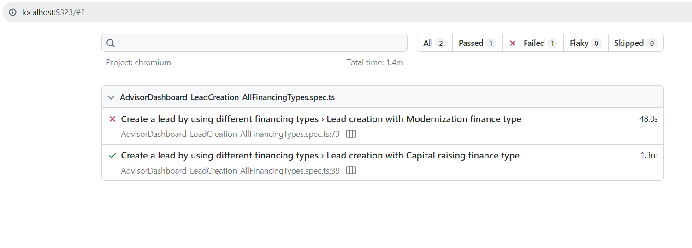
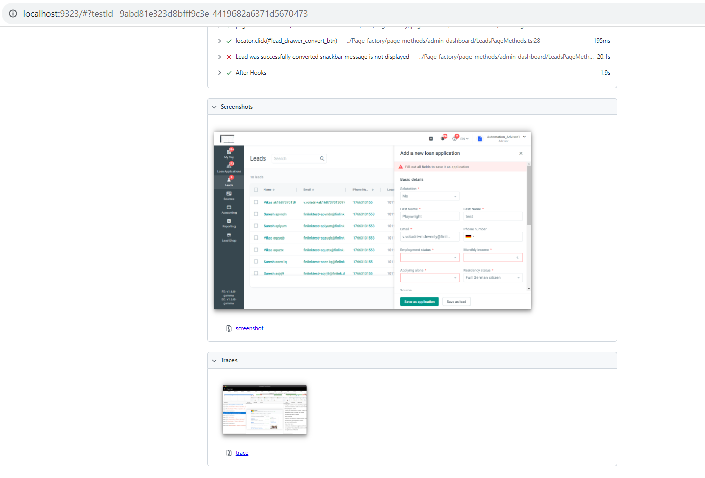

# playwright-test-suite

Automated tests for our Finlink project which contains UI automation.

## Tools

* Playwright
* Typescript

## Requirements

In order to utilise this project you need to have the following installed locally:

* Node.js should be installed and other dependencies you can install later stage.

Install the node.js from official website [node.js](https://nodejs.org/en/download/).

* Visual Studio Code should be installed

Install Visual studio code from the website [VS code](https://code.visualstudio.com/download).

## Usage

This automation scripts are developed for UI.

After node.js installation you can clone the repo or download the zip file, Open that code in Visual Studio.

Then open the terminal and navigate to the root directory [where package.json exists]: 

This command will install all the dependencies that are present in the package.json file

    npm install 

For updating to the latest version of playwright and also browsers you can run the following command in terminal: 

    npm install playwright

### Pass credentials from .env file and run the tests :

Enter the credentials in .env file like

    admin_username="xyyAdmin@finlink.de"
    admin_password="user@11"
    advisor_username="abcAdvisor@finlink.de"
    advisor_password="adv@11"

Navigate to root directory to run all tests navigate to root directory and run the following command:

    npx playwright test

To run individual spec files run:

    npx playwright test tests/spec_name.spec.ts

## Reporting

Reports will be generated as a html format. If any spec file is failed it will auto-open the report, and if all specs are passed then you need manually open the report by typing this following command in terminal:

    npx playwright test show-report

* In the html reports you can see the total number of tests that are ran with the results as Passed or Failed

* For the failed testcase you can see the screenshot and trace for easy debugging

